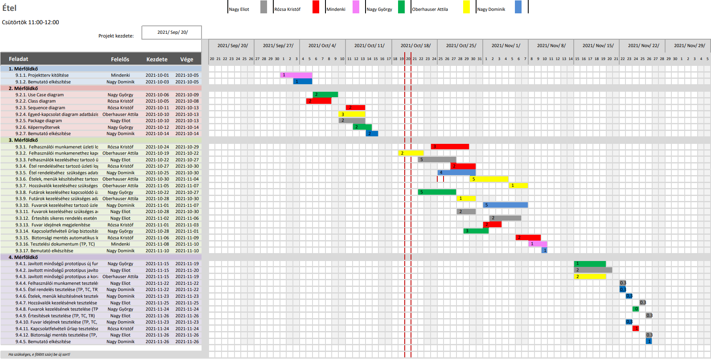

# Étel Projektterv 2021

## 1. Összefoglaló 

Az étel lényege, hogy az ügyfelek a legjobb ételekhez jussanak, legkisebb költséggel, legbiztonságosabban és megfelelő időben. A projekt lényege, hogy összeszedje az éttermeket, így mindent megtalálhatsz egy helyen. Az oldal lehetővé teszi az étel kiszállítását bármerre az országban.  A kiszállítás lehető leggyorsabb módon működik, hiszen rengeteg fuvarozó dolgozik nekünk. Mindezen funkciókat egy letisztult felületen keresztül tudja elérni a felhasználó.

## 2. Verziók

| Verzió | Szerző(k)                | Dátum        | Státusz         | Megjegyzés                                                    |
|--------|--------------------------|--------------|-----------------|---------------------------------------------------------------|
| `0.1`  | `Teszt Elek`             | `2021-09-26` | `Tervezet`      | `Legelső verzió`                                              |
| `0.2`  | `Remek Elek, Teszt Elek` | `2021-10-04` | `Előterjesztés` | `A projekt menedzsere jónak találta`                          |
| `1.0`  | `Lev Elek`               | `2021-10-11` | `Elfogadott`    | `Apróbb átszervezések a kommentek alapján`                    |
| `1.1`  | `Remek Elek`             | `2021-10-15` | `Tervezet`      | `Személyes felelősségek átszervezése, Gantt chart módosítása` |
| `1.1`  | `Lev Elek`               | `2021-10-18` | `Előterjesztés` | `2. mérföldkő további módosításai`                            |
| `2.1`  | `Remek Elek`             | `2021-10-25` | `Elfogadott`    | `Leírások pontosítása a megjegyzések alapján`                 |


Státusz osztályozás:
 - Tervezet: befejezetlen dokumentum, a mérföldkő leadása előtti napokban
 - Előterjesztés: a projekt menedzser bírálatával, a mérföldkő határidejekor
 - Elfogadott: a megrendelő által elfogadva, a prezentáció bemutatásakor

```
A leadott projekttervet véglegesnek kell tekinteni. 
Mindazonáltal indokolt esetben ettől el lehet térni, amennyiben a gyakorlatvezető engedélyezi.
A fő változtatásokat itt kell vezetni a projekt teljes ideje alatt (jelenlegi példánkban most lett vége a 2. mérföldkőnek). 
Általánosságban elmondható, hogy az első 2 mérföldkő során gyakoribb a változtatás, így legalább 
3 fő verziót érdemes megjelölni (Tervezet-Előterjesztés-Elfogadott).
A verzió számozásának következetesnek kell lennie. A szerzőknél azoknak a nevét kell felsorolni, akik hozzájárultak a fő verzióhoz,
azaz nem feltétlen mindenki, aki módosította a dokumentumot pl. egy elírás javításával. 
```

## 3. A projekt bemutatása

Ez a projektterv az Étel projektet mutatja be, mely 2021-09-20-től 2021-11-27-ig tart. A projekt célja, hogy megfelelő felületet biztosítson online ételrendelésre és az adatok nyilvántartására. Mindezért egy egyszerűen használható, átlátható és hatékonyan működő webalkalmazás fog felelni. A projekten öt fő fejlesztő fog dolgozni, az elvégzett feladatokat pedig négy alkalommal fogjuk prezentálni a megrendelőnek.


### 3.1. Rendszerspecifikáció

A rendszernek képesnek kell lennie ételrendelés fogadására és feldolgozására, miközben a felhasználót megfelelően tájékoztatja rendelése menetéről. Továbbá képes lesz tárolni és kilistázni a korábbi rendeléseket. Ezenkívül a cég futárait is számon tartja és jelzi azok státuszát(ki dolgozik, ki nincs éppen kiszállításban). Minden funkció a megfelelő felhasználói jogosultság mellett lesz használható.


### 3.2. Funkcionális követelmények

 - Felhasználói munkamenet megvalósítása több jogosultsági szinttel (admin, user)
 - Felhasználók kezelése (CRUD)
 - Rendelők kezelése (CRUD)
 - Élelmiszer raktárak kezelése (CRUD)
 - Futárok kezelése (CRUD)
 - Rendelések kezelése (CRUD)
 - Rendelés folyamatának megjelenítése
 - Biztonsági mentés automatikus létrehozása
 
```
Felhasználók, rendelők, élelmiszerek, futárok és rendelések beszúrása, törlése, nyílvántartása, illetve kezelése.
Reszponzív grafikus felhasználói felület biztosítása a rendszer felhasználója számára.
```

### 3.3. Nem funkcionális követelmények

 - A kliens oldal platform- és böngészőfüggetlen legyen
 - Reszponzív megjelenés
 - Szenzitív adatokat biztonságosan tároljuk

```
A rendszer Windows 10 operációs rendszeren fut, Chromium alapú böngészőkön, modern minimalista megjelenést célozva.
```

## 4. Költség- és erőforrás-szükségletek

Az erőforrásigényünk összesen kb. `22` személynap/fő.

A rendelkezésünkre áll összesen 5 * 70 = 350 pont.


## 5. Szervezeti felépítés és felelősségmegosztás
A projekt megrendelője Márkus András. Az Étel projektet a projektcsapat fogja végrehajtani, amely jelenleg öt fejlesztőből áll. A csapatban pályakezdő webprogramozók vannak, mindenkinek van legalább egy év egyetemi tapasztalata.
 - Nagy György (1 év egyetemi tapasztalat)
 - Nagy Eliot (1 év egyetemi tapasztalat)
 - Rózsa Kristóf (1 év egyetemi tapasztalat)
 - Oberhauser Attila (3 év egyetemi tapasztalat)
 - Nagy Dominik (2 év egyetemi tapasztalat)


### 5.1 Projektcsapat
A projekt a következő emberekből áll:

|                                                                                                                   | Név             | E-mail cím (stud-os)       |
|-------------------------------------------------------------------------------------------------------------------|-----------------|----------------------------|
| Megrendelő                                                                                                        | Márkus András | markusa@inf.u-szeged.hu  |
| Felelősségek: Projekt menedzser, Dokumentáció 				    												| Nagy György  | h049468@stud.u-szeged.hu |
| Felelősségek: Adatbázis és adatkapcsolatok,                                										| Oberhauser Attila    | h879870@stud.u-szeged.hu |
| Felelősségek: Felhasználói felületek                                                                              | Nagy Eliot      | h049431@stud.u-szeged.hu |
| Felelősségek: A rendszer működési logikája                                                                        | Rózsa Kristóf      | h051111@stud.u-szeged.hu |
| Felelősségek: Prezentációk                                                                       					| Nagy Dominik     | h984509@stud.u-szeged.hu |


## 6. A munka feltételei

### 6.1. Munkakörnyezet
A projekt a következő munkaállomásokat fogja használni a munka során:
 - Munkaállomások: 6 db PC Windows 10-es operációs rendszerrel
 - ASUS ROG Strix laptop (CPU: i7-6700HQ, RAM: 8 GB, GPU: Nvidia GTX 960M)
 - Acer Apsire V 15 V5-591G-55TU laptop (CPU: Intel core i5-6300HQ, RAM: 8 GB, GPU: Nvidia GeForce GTX 950M)
 - Asztali számítógép (CPU: i7 8700k, RAM: 16GB, GPU: ASUS GeForce GTX 1070 OC 8GB)
 - HP Pavilion 14 laptop (CPU: i5 8250U, RAM: 8 GB, GPU: Nvidia GeForce)
 - ASUS Vivobook 15 laptop (CPU: Ryzen 5 3500, RAM : 8GB, GPU: Vega 8)
 - Windows 10 PC (CPU: FX6300, RAM : 16gb, GPU: GTX750Ti)

A projekt a következő technológiákat/szoftvereket fogja használni a munka során: 
 - Heroku platformszolgáltatás
 - Heroku által biztosított PostgreSQL adatbázisszerver
 - Spring Boot (backend)
 - `React.js (frontend)`
 - `Maven szoftverprojekt menedzselő szoftver`
 - `Eclipse IDE`
 - Clion
 - Git verziókövető (GitLab)
 - IntelliJ IDEA


### 6.2. Rizikómenedzsment

| Kockázat                                    | Leírás                                                                                                                                                                                     | Valószínűség | Hatás  |
|---------------------------------------------|--------------------------------------------------------------------------------------------------------------------------------------------------------------------------------------------|--------------|--------|
| Betegség                                    | Súlyosságtól függően hátráltatja vagy bizonyos esetekben teljes mértékben korlátozza a munkavégzőt, így az egész projektre kihatással van. Megoldás: a feladatok átcsoportosítása          |  kis       | erős |
| Kommunikációs fennakadás a csapattagokkal   | A csapattagok között nem elégséges az információ áramlás, nem pontosan, esetleg késve vagy nem egyértelműen tájékoztatjuk egymást. Megoldás: még gyakoribb megbeszélések és ellenőrzése    |  kis       |  erős |
| Szervízben lévő munkagép                    | A munkagép javítása. Megoldás: másik gép használat, feladatok átütemezése, hardvercsere																										| nagy      | gyenge


## 7. Jelentések

### 7.1. Munka menedzsment
A munkát Nagy György koordinálja. Fő feladata, hogy folyamatosan egyeztessen a csapattagokkal az előrehaladásról és a fellépő problémákról, esetlegesen a megoldásban is segítséget nyújthat a projekt csúszásának elkerülése végett. További feladata a heti szinten tartandó csoportgyűlések időpontjának és helyszínének leszervezése, erről Discordon tájékoztatja a projektcsapatot. 


### 7.2. Csoportgyűlések

A projekt hetente ülésezik, hogy megvitassák az azt megelőző hét problémáit, illetve hogy megbeszéljék a következő hét feladatait.

 1. megbeszélés:
	- Időpont: 2021.09.23.
	- Hely: SZTE Irinyi épület - Szeged, Tisza Lajos krt. 103
	- Résztvevők: Nagy Dominik, Nagy Eliot, Nagy György, Rózsa Kristóf, Oberhauser Attila
	- Érintett témák: Ismerkedés, projekttéma kiválasztása

 2. megbeszélés:
	- Időpont: 2021.10.01.
	- Hely: Discord
	- Résztvevők: Nagy Dominik, Nagy Eliot, Nagy György, Rózsa Kristóf, Oberhauser Attila
	- Érintett témák: A projektben használt technológiák, szerepkörök kiosztása, projektterv kisebb részekre felosztása

### 7.3. Minőségbiztosítás

Az elkészült terveket a terveken nem dolgozó csapattársak közül átnézik, hogy megfelel-e a specifikációnak és az egyes diagramtípusok összhangban vannak-e egymással. A meglévő rendszerünk helyes működését a prototípusok bemutatása előtt a tesztelési dokumentumban leírtak végrehajtása alapján ellenőrizzük és összevetjük a specifikációval, hogy az elvárt eredményt kapjuk-e. További tesztelési lehetőségek: unit tesztek írása az egyes modulokhoz vagy a kód közös átnézése (code review) egy, a vizsgált modul programozásában nem résztvevő csapattaggal. Szoftverünk minőségét a végső leadás előtt javítani kell a rendszerünkre lefuttatott kódelemzés során kapott metrikaértékek és szabálysértések figyelembevételével.
Az alábbi lehetőségek vannak a szoftver megfelelő minőségének biztosítására:
- Specifikáció és tervek átnézése (kötelező)
- Teszttervek végrehajtása (kötelező)
- Unit tesztek írása (választható)
- Kód átnézése (választható)

### 7.4. Átadás, eredmények elfogadása

A projekt eredményeit Márkus András fogja elfogadni. A projektterven változásokat csak  Márkus András írásos kérés esetén Márkus András engedélyével lehet tenni. A projekt eredményesnek bizonyul, ha specifikáció helyes és határidőn belül készül el. Az esetleges késések pontlevonást eredményeznek.
Az elfogadás feltételeire és beadás formájára vonatkozó részletes leírás a következő honlapon olvasható: https://okt.sed.hu/rf1/

### 7.5. Státuszjelentés

Minden leadásnál a projektmenedzser jelentést tesz a projekt haladásáról, és ha szükséges változásokat indítványoz a projektterven. Ezen kívül a megrendelő felszólítására a menedzser 3 munkanapon belül köteles leadni a jelentést. A gyakorlatvezetővel folytatott csapatmegbeszéléseken a megadott sablon alapján emlékeztetőt készít a csapat, amit a következő megbeszélésen áttekintenek és felmérik az eredményeket és teendőket. Továbbá gazdálkodnak az erőforrásokkal és szükség esetén a megrendelővel egyeztetnek a projektterv módosításáról.

## 8. A munka tartalma

### 8.1. Tervezett szoftverfolyamat modell és architektúra

A szoftver fejlesztése során az iteratív és inkrementális fejlesztési modellt alkalmazzuk. A fejlesztés során nagy hangsúlyt fektetünk a folyamatos kommunikcióra. A fejlesztés során a szoftver specifikációi rugalmasan vátozhatnak, és ezzel a módszertannal tudunk a leggyorsabban alkalmazkodni az új elvárásokhoz.

`A szoftver MVC alapú REST webszolgáltatásként működik. A szerver és a kliens függetlenek, csupán API végpontok segítségével kommunikálnak.`


### 8.2. Átadandók és határidők
A főbb átadandók és határidők a projekt időtartama alatt a következők:


| Szállítandó |                 Neve                |   Határideje  |
|:-----------:|:-----------------------------------:|:-------------:|
|      D1     |       Projektterv és útmutató       | 2021-10-05  |
|    P1+D2    | UML, DB, képernyőtervek és bemutató | 2021-10-20  |
|    P1+D3    |      Prototípus I. és bemutató      | 2021-11-10  |
|    P2+D4    |      Prototípus II. és bemutató     | 2021-12-01  |


## 9. Feladatlista

A következőkben a tervezett feladatok részletes összefoglalása található.


### 9.1. Projektterv (1. mérföldkő)

Ennek a feladatnak az a célja, hogy megvalósításhoz szükséges lépéseket, az ütemzést és a felelősöket meghatározzuk.

Részfeladatai a következők:

#### 9.1.1. Projektterv kitöltése

Felelős: Mindenki

Tartam:  4 nap

Erőforrásigény:  1 személynap/fő


#### 9.1.2. Bemutató elkészítése

Felelős: Nagy Dominik

Tartam:  3 nap

Erőforrásigény:  1 személynap


### 9.2. UML és adatbázis tervek (2. mérföldkő)

Ennek a feladatnak az a célja, hogy a rendszerarchitektúrát, az adatbázist és webalkalmazás kinézetét megtervezzük.

Részfeladatai a következők:

#### 9.2.1. Use Case diagram

Felelős: Nagy György

Tartam:  4 nap

Erőforrásigény:  2 személynap

#### 9.2.2. Class diagram

Felelős:  Rózsa Kristóf

Tartam:  4 nap

Erőforrásigény:  2 személynap

#### 9.2.3. Sequence diagram

Felelős:  Rózsa Kristóf

Tartam:  3 nap

Erőforrásigény:  2 személynap

#### 9.2.4. Egyed-kapcsolat diagram adatbázishoz

Felelős: Oberhauser Attila

Tartam:  4 nap

Erőforrásigény: 3 személynap

#### 9.2.5. Package diagram

Felelős: Nagy Eliot

Tartam:  4 nap

Erőforrásigény:  2 személynap

#### 9.2.6. Képernyőtervek

Felelős: Nagy György

Tartam:  3 nap

Erőforrásigény:  2 személynap

#### 9.2.7. Bemutató elkészítése

Felelős: Nagy Dominik

Tartam:  2 nap

Erőforrásigény: 2 személynap


### 9.3. Prototípus I. (3. mérföldkő)

Ennek a feladatnak az a célja, hogy egy működő prototípust hozzunk létre, ahol a vállalt funkcionális követelmények nagy része már prezentálható állapotban van.

Részfeladatai a következők:

#### 9.3.1.  Felhasználói munkamenet üzleti logikája több jogosultsági szinttel (admin, user)

Felelős: Rózsa Kristóf

Tartam:  5 nap

Erőforrásigény:  2 személynap

#### 9.3.2.  Felhasználói munkamenethez kapcsolódó GUI megvalósítása

Felelős: Oberhauser Attila

Tartam:  4 nap

Erőforrásigény:  2 személynap

#### 9.3.3.  Felhasználói munkamenethez szükséges adatok létrehozása az adatbázisban

Felelős: Oberhauser Attila

Tartam:  3 nap

Erőforrásigény:  1 személynap

#### 9.3.4.  Felhasználók kezeléséhez tartozó üzleti logika (listázása, módosítása, létrehozása, törlése)

Felelős: Nagy Eliot

Tartam:  4 nap

Erőforrásigény:  3 személynap

#### 9.3.5.  Felhasználók kezeléséhez kapcsolódó GUI megvalósítása

Felelős: Nagy György

Tartam:  3 nap

Erőforrásigény:  2 személynap

#### 9.3.6.  Étel rendeléséhez tartozó üzleti logika (listázása, módosítása, létrehozása, törlése)

Felelős: Rózsa Kristóf

Tartam:  4 nap

Erőforrásigény:  2 személynap

#### 9.3.7.   Étel rendeléséhez kapcsolódó GUI megvalósítása

Felelős: Nagy Dominik

Tartam:  4 nap

Erőforrásigény:  3 személynap

#### 9.3.8.  Étel rendeléséhez  szükséges adatok létrehozása az adatbázisban

Felelős: Nagy Dominik

Tartam:  3 nap

Erőforrásigény:  1 személynap

#### 9.3.9.  Ételek, menük készítéséhez tartozó üzleti logika (listázása, módosítása, létrehozása, törlése)

Felelős: Nagy Eliot

Tartam:  5 nap

Erőforrásigény:  3 személynap

#### 9.3.10.  Ételek, menük készítéséhez kapcsolódó GUI megvalósítása

Felelős: Oberhauser Attila

Tartam:  5 nap

Erőforrásigény:  2 személynap

#### 9.3.11.  Hozzávalók kezeléséhez szükséges adatok létrehozása az adatbázisban

Felelős: Oberhauser Attila

Tartam:  3 nap

Erőforrásigény:  1 személynap

#### 9.3.12.  Futárok kezeléséhez kapcsolódó üzleti logika (listázása, módosítása, létrehozása, törlése)

Felelős: Rózsa Kristóf

Tartam:  4 nap

Erőforrásigény:  2 személynap

#### 9.3.13.  Futárok kezeléséhez kapcsolódó GUI megvalósítása

Felelős: Nagy György

Tartam:  5 nap

Erőforrásigény:  3 személynap

#### 9.3.14.  Futárok kezeléséhez szükséges adatok létrehozása az adatbázisban

Felelős: Oberhauser Attila

Tartam:  3 nap

Erőforrásigény:  1 személynap

#### 9.3.15.  Fuvarok kezeléséhez tartozó üzleti logika (listázása, módosítása, létrehozása, törlése)

Felelős: Nagy Dominik

Tartam:  4 nap

Erőforrásigény:  2 személynap

#### 9.3.16.  Fuvarok kezeléshez kapcsolódó GUI megvalósítása

Felelős: Nagy György

Tartam:  5 nap

Erőforrásigény:  3 személynap

#### 9.3.17.  Fuvarok kezeléséhez szükséges adatok létrehozása az adatbázisban

Felelős: Nagy Eliot

Tartam:  3 nap

Erőforrásigény:  2 személynap

#### 9.3.18.  Értesítés sikeres rendelés esetén

Felelős: Oberhauser Attila

Tartam:  5 nap

Erőforrásigény:  2 személynap

#### 9.3.19.  Fuvar idejének megjelenítése 

Felelős: Rózsa Kristóf

Tartam:  3 nap

Erőforrásigény:  1 személynap

#### 9.3.20.  Kapcsolatfelvételi űrlap biztosítása új ügyfelek számára (üzleti logika és GUI)

Felelős: Nagy Dominik

Tartam:  4 nap

Erőforrásigény:  2 személynap

#### 9.3.21.  Biztonsági mentés automatikus létrehozása

Felelős: Rózsa Kristóf

Tartam:  4 nap

Erőforrásigény:  2 személynap

#### 9.3.22. Tesztelési dokumentum (TP, TC)

Felelős: Mindenki

Tartam:  3 nap

Erőforrásigény:  1 személynap/fő


#### 9.3.23. Bemutató elkészítése 

Felelős: Nagy Dominik

Tartam:  1 nap

Erőforrásigény:  1 személynap


### 9.4. Prototípus II. (4. mérföldkő)

Ennek a feladatnak az a célja, hogy az előző mérföldkő hiányzó funkcióit pótoljuk, illetve a hibásan működő funkciókat és az esetlegesen felmerülő új funkciókat megvalósítsuk. Továbbá az alkalmazás alapos tesztelése is a mérföldkőben történik.

Részfeladatai a következők:

#### 9.4.1. Javított minőségű prototípus új funkciókkal

Felelős: Nagy György

Tartam:  5 nap

Erőforrásigény:  1 személynap

#### 9.4.2. Javított minőségű prototípus javított funkciókkal

Felelős: Nagy Eliot

Tartam:  5 nap

Erőforrásigény:  2 személynap

#### 9.4.3. Javított minőségű prototípus a korábbi hiányzó funkciókkal

Felelős: Oberhauser Attila

Tartam:  5 nap

Erőforrásigény:  2 személynap

#### 9.4.4. Felhasználói munkamenet tesztelése (TP, TC, TR)

Felelős: Nagy Eliot

Tartam:  1 nap

Erőforrásigény:  0.3 személynap

#### 9.4.5. Étel rendelés tesztelése (TP, TC, TR)

Felelős: Nagy Dominik

Tartam:  1 nap

Erőforrásigény:  0.3 személynap

#### 9.4.6. Ételek, menük készítésének tesztelése (TP, TC, TR)

Felelős: Nagy Dominik

Tartam:  1 nap

Erőforrásigény:  0.3 személynap

#### 9.4.7. Hozzávalók kezelésének tesztelése (TP, TC, TR)

Felelős: Nagy Eliot

Tartam:  1 nap

Erőforrásigény:  0.3 személynap

#### 9.4.8. Fuvarok kezelésének tesztelése (TP, TC, TR)

Felelős: Nagy György

Tartam:  1 nap

Erőforrásigény:  0.3 személynap

#### 9.4.9. Értesítések tesztelése (TP, TC, TR)

Felelős: Nagy Eliot

Tartam:  1 nap

Erőforrásigény:  0.3 személynap

#### 9.4.10. Fuvar idejének tesztelése (TP, TC, TR)

Felelős: Nagy Dominik

Tartam:  1 nap

Erőforrásigény:  0.3 személynap

#### 9.4.11. Kapcsolatfelvételi űrlap tesztelése (TP, TC, TR)

Felelős: Rózsa Kristóf

Tartam:  1 nap

Erőforrásigény:  0.3 személynap

#### 9.4.12. Biztonsági mentés tesztelése (TP, TC, TR)

Felelős: Nagy Eliot

Tartam:  1 nap

Erőforrásigény:  0.3 személynap

#### 9.4.13. Bemutató elkészítése 

Felelős: Nagy Dominik

Tartam:  1 nap

Erőforrásigény:  1 személynap


## 10. Részletes időbeosztás



```
Ide kell berakni a Gantt diagramot, amely a 9. fejezetben található részfeladatokat tartalmazza felelős/tartam bontásban.
```

## 11. Projekt költségvetés


### 11.1. Részletes erőforrásigény (személynap)


|                     Név                    | 1. leadás - Projektterv | 2. leadás - UML és adatbázis | 3. leadás - Prototípus I. | 4. leadás - Prototípus II. | Összesen |
|:------------------------------------------:|:----------------------:|:--------------------------:|:-----------------------:|:------------------------:|:---------:|
|                     Nagy György            |           `2`          |             `3`            |           `16`          |            `4`           |    `25`   |
|                     Nagy Eliot             |            1           |              2             |             9           |             3.2          |     15.2  |
|					  Rózsa Kristóf			 |			  1 		  |				 4			   |			10			 |			   0.3			|	  ?		|
|					  Nagy Dominik			 |			  2 		  |				 2			   |			10			 |			   1.9			|	  15.9	|


### 11.2. Részletes feladatszámok

|                     Név                    | 1. leadás - Projektterv | 2. leadás - UML és adatbázis | 3. leadás - Prototípus I. | 4. leadás - Prototípus II. | Összesen |
|:------------------------------------------:|:----------------------:|:--------------------------:|:-----------------------:|:------------------------:|:---------:|
|                     Nagy Eliot             |            1           |              1             |            4            |             4            |    10     |
| 					  Rózsa Kristóf			 |			  1			  |				2			   |			6			 |			   1			|	 11		|
| 					  Nagy Dominik			 |			  2			  |				1			   |			5			 |			   4			|	 12		|

### 11.3. Részletes költségvetés

|                     Név                       | 1. leadás - Projektterv | 2. leadás - UML és adatbázis | 3. leadás - Prototípus I. | 4. leadás - Prototípus II. | Összesen |
|:---------------------------------------------:|:----------------------:|:--------------------------:|:-----------------------:|:------------------------:|:---------:|
|        Maximálisan választható pontszám %-ban |         10% (7)        |            30% (21)        |          50% (35)       |          30% (21)        | 100% (70) |
|					   Rózsa Kristóf			| 			4			 |				16			  |			  35			|			  15		   |	 70	   |
|					   Nagy Dominik				| 			6			 |				17			  |			  32			|			  15		   |	 70	   |

Szeged, `2021-10-25`.
